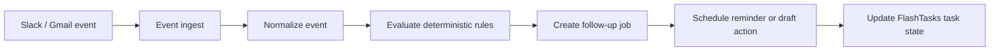

# Hermes

Hermes is the execution layer for lightweight message integration in FlashTasks. It is not a chatbot. The MVP focuses on Slack and Gmail connection flows plus simple task scheduling metadata.

## Architecture

### Service Layers

- `api/hermes/_shared`: shared request, Appwrite, crypto, and tenant helpers
- `api/hermes/integrations/core`: OAuth state, provider normalization, reusable integration record helpers
- `api/hermes/integrations/slack`: Slack-specific OAuth and callback handlers
- `api/hermes/integrations/email`: Gmail OAuth and callback handlers
- `src/hermes`: TypeScript interfaces for the Hermes domain

## Appwrite Schema

Create these collections in the Hermes Appwrite database.

Provider metadata like names, descriptions, and active state can live in frontend config or seed data instead of a dedicated Appwrite collection.

### `connected_accounts`

`organizationId` is optional. Leave it blank for individual users.

- `provider` string
- `organizationId` string, optional
- `workspaceId` string
- `userId` string
- `userEmail` string
- `accountId` string
- `externalAccountId` string
- `externalWorkspaceId` string
- `accountName` string
- `tokenType` string
- `accessToken` string
- `refreshToken` string
- `scope` string
- `status` string
- `metadata` string
- `connectedAt` datetime

### `conversation_threads`

- `organizationId` string, optional
- `provider` string
- `workspaceId` string
- `accountId` string
- `userId` string
- `userEmail` string
- `threadKey` string
- `subject` string
- `lastInboundAt` datetime
- `lastOutboundAt` datetime
- `status` string
- `taskId` string

### `activity_logs`

- `organizationId` string, optional
- `provider` string
- `userId` string
- `userEmail` string
- `entityType` string
- `entityId` string
- `message` string
- `severity` string
- `payload` string

Appwrite provides `$createdAt` and `$updatedAt` automatically on these documents.

### `tasks` collection fields used by Hermes

Hermes can use the existing FlashTasks tasks collection instead of a separate scheduled-tasks collection. The task document can carry these optional fields when Hermes needs to mark a task as scheduled:

- `scheduledAt` datetime
- `scheduleStatus` string
- `scheduleSource` string
- `schedulePayload` string
- `scheduleUpdatedAt` datetime

## API Endpoints

- `POST /api/hermes/integrations/slack/connect`
- `GET|POST /api/hermes/integrations/slack/callback`
- `POST /api/hermes/integrations/email/connect`
- `GET|POST /api/hermes/integrations/email/callback`

Recommended follow-up endpoints to add next:

- `POST /api/hermes/integrations/disconnect`
- `GET /api/hermes/integrations/list`
- `POST /api/hermes/integrations/slack/send`
- `POST /api/hermes/webhooks/slack`
- `POST /api/hermes/webhooks/gmail`

## OAuth Flow

### Slack

1. Client calls `POST /api/hermes/integrations/slack/connect`.
2. Server returns a signed OAuth URL and state.
3. Slack redirects back to the callback.
4. Callback exchanges `code` for tokens.
5. Tokens are encrypted before storage.
6. Workspace/account metadata is saved in `connected_accounts`.
7. Slack webhooks are verified with the signing secret and normalized into conversation threads and activity logs.
8. Follow-up jobs are queued deterministically when a thread stalls.
9. Outbound messages use `POST /api/hermes/integrations/slack/send`.

### Gmail

1. Client calls `POST /api/hermes/integrations/email/connect`.
2. Server returns a Google OAuth URL with offline access.
3. Google redirects to callback with `code`.
4. Callback exchanges the code for access and refresh tokens.
5. Profile metadata is fetched and stored with the connected account.

## Implementation Order

1. Create Appwrite collections and indexes.
2. Add Slack OAuth connection and callback.
3. Add Gmail OAuth connection and callback.
4. Persist connected accounts with encrypted tokens.
5. Ingest events and normalize threads.
6. Update the existing FlashTasks task document when Hermes needs to mark a task as scheduled or pending.
7. Add disconnect/list APIs and webhook handlers.

## Env Vars

- `APPWRITE_ENDPOINT`
- `APPWRITE_PROJECT_ID`
- `APPWRITE_API_KEY`
- `APPWRITE_DATABASE_ID`
- `HERMES_CONNECTED_ACCOUNTS_COLLECTION_ID`
- `HERMES_TOKEN_ENCRYPTION_SECRET`
- `HERMES_OAUTH_STATE_SECRET`
- `HERMES_TASKS_COLLECTION_ID`
- `SLACK_CLIENT_ID`
- `SLACK_CLIENT_SECRET`
- `SLACK_REDIRECT_URI`
- `GOOGLE_CLIENT_ID`
- `GOOGLE_CLIENT_SECRET`
- `GOOGLE_REDIRECT_URI`
