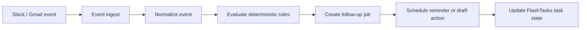

# Hermes

Hermes is the execution layer for proactive follow-up automation in FlashTasks. It is not a chatbot. The MVP focuses on deterministic workflows for Slack and Gmail, with shared automation primitives that can later power WhatsApp, SMS, or marketplace workflows.

## Architecture

### Service Layers

- `api/hermes/_shared`: shared request, Appwrite, crypto, and tenant helpers
- `api/hermes/integrations/core`: OAuth state, provider normalization, reusable integration record helpers
- `api/hermes/integrations/slack`: Slack-specific OAuth and callback handlers
- `api/hermes/integrations/email`: Gmail OAuth and callback handlers
- `api/hermes/automation`: deterministic rule evaluation and execution
- `api/hermes/events`: event ingestion entrypoint
- `api/hermes/followups`: queue and pending job inspection
- `src/hermes`: TypeScript interfaces for the automation domain

## Appwrite Schema

Create these collections in the Hermes Appwrite database.

Provider metadata like names, descriptions, and active state can live in frontend config or seed data instead of a dedicated Appwrite collection.

### `connected_accounts`

- `provider` string
- `organizationId` string
- `workspaceId` string
- `userId` string
- `userEmail` string
- `accountId` string
- `externalAccountId` string
- `externalWorkspaceId` string
- `accountName` string
- `tokenType` string
- `accessToken` string
- `refreshToken` string
- `scope` string
- `status` string
- `metadata` string
- `connectedAt` datetime
- `updatedAt` datetime

### `automation_rules`

- `organizationId` string
- `workspaceId` string
- `userId` string
- `userEmail` string
- `name` string
- `trigger` string
- `conditions` string
- `actions` string
- `enabled` boolean
- `createdAt` datetime
- `updatedAt` datetime

### `followup_jobs`

- `organizationId` string
- `userId` string
- `userEmail` string
- `threadKey` string
- `provider` string
- `jobType` string
- `status` string
- `priority` string
- `payload` string
- `runAt` datetime
- `lastError` string
- `createdAt` datetime
- `updatedAt` datetime

### `scheduled_tasks`

- `organizationId` string
- `userId` string
- `userEmail` string
- `followupJobId` string
- `taskId` string
- `status` string
- `dueAt` datetime
- `payload` string
- `createdAt` datetime
- `updatedAt` datetime

### `conversation_threads`

- `organizationId` string
- `provider` string
- `workspaceId` string
- `accountId` string
- `userId` string
- `userEmail` string
- `threadKey` string
- `subject` string
- `lastInboundAt` datetime
- `lastOutboundAt` datetime
- `status` string
- `taskId` string
- `createdAt` datetime
- `updatedAt` datetime

### `activity_logs`

- `organizationId` string
- `provider` string
- `userId` string
- `userEmail` string
- `entityType` string
- `entityId` string
- `message` string
- `severity` string
- `payload` string
- `createdAt` datetime

## API Endpoints

- `POST /api/hermes/integrations/slack/connect`
- `GET|POST /api/hermes/integrations/slack/callback`
- `POST /api/hermes/integrations/email/connect`
- `GET|POST /api/hermes/integrations/email/callback`
- `POST /api/hermes/events/ingest`
- `POST /api/hermes/automation/create`
- `POST /api/hermes/automation/execute`
- `GET /api/hermes/followups/queue`

Recommended follow-up endpoints to add next:

- `POST /api/hermes/integrations/disconnect`
- `GET /api/hermes/integrations/list`
- `POST /api/hermes/integrations/slack/send`
- `POST /api/hermes/webhooks/slack`
- `POST /api/hermes/webhooks/gmail`

## OAuth Flow

### Slack

1. Client calls `POST /api/hermes/integrations/slack/connect`.
2. Server returns a signed OAuth URL and state.
3. Slack redirects back to the callback.
4. Callback exchanges `code` for tokens.
5. Tokens are encrypted before storage.
6. Workspace/account metadata is saved in `connected_accounts`.
7. Slack webhooks are verified with the signing secret and normalized into conversation threads and activity logs.
8. Follow-up jobs are queued deterministically when a thread stalls.
9. Outbound messages use `POST /api/hermes/integrations/slack/send`.

### Gmail

1. Client calls `POST /api/hermes/integrations/email/connect`.
2. Server returns a Google OAuth URL with offline access.
3. Google redirects to callback with `code`.
4. Callback exchanges the code for access and refresh tokens.
5. Profile metadata is fetched and stored with the connected account.

## Deterministic Follow-Up Rules

Start without AI. Use fixed rules:

- unanswered inbound message after 24 hours => schedule reminder
- stalled conversation after 48 hours => draft follow-up and mark task pending
- message thread reopened => reset reminder timers

## Implementation Order

1. Create Appwrite collections and indexes.
2. Add Slack OAuth connection and callback.
3. Add Gmail OAuth connection and callback.
4. Persist connected accounts with encrypted tokens.
5. Ingest events and normalize threads.
6. Evaluate follow-up rules and enqueue jobs.
7. Execute queued jobs and update FlashTasks task state.
8. Add disconnect/list APIs and webhook handlers.

## Env Vars

- `APPWRITE_ENDPOINT`
- `APPWRITE_PROJECT_ID`
- `APPWRITE_API_KEY`
- `APPWRITE_DATABASE_ID`
- `HERMES_CONNECTED_ACCOUNTS_COLLECTION_ID`
- `HERMES_AUTOMATION_RULES_COLLECTION_ID`
- `HERMES_FOLLOWUP_JOBS_COLLECTION_ID`
- `HERMES_TOKEN_ENCRYPTION_SECRET`
- `HERMES_OAUTH_STATE_SECRET`
- `SLACK_CLIENT_ID`
- `SLACK_CLIENT_SECRET`
- `SLACK_REDIRECT_URI`
- `GOOGLE_CLIENT_ID`
- `GOOGLE_CLIENT_SECRET`
- `GOOGLE_REDIRECT_URI`
